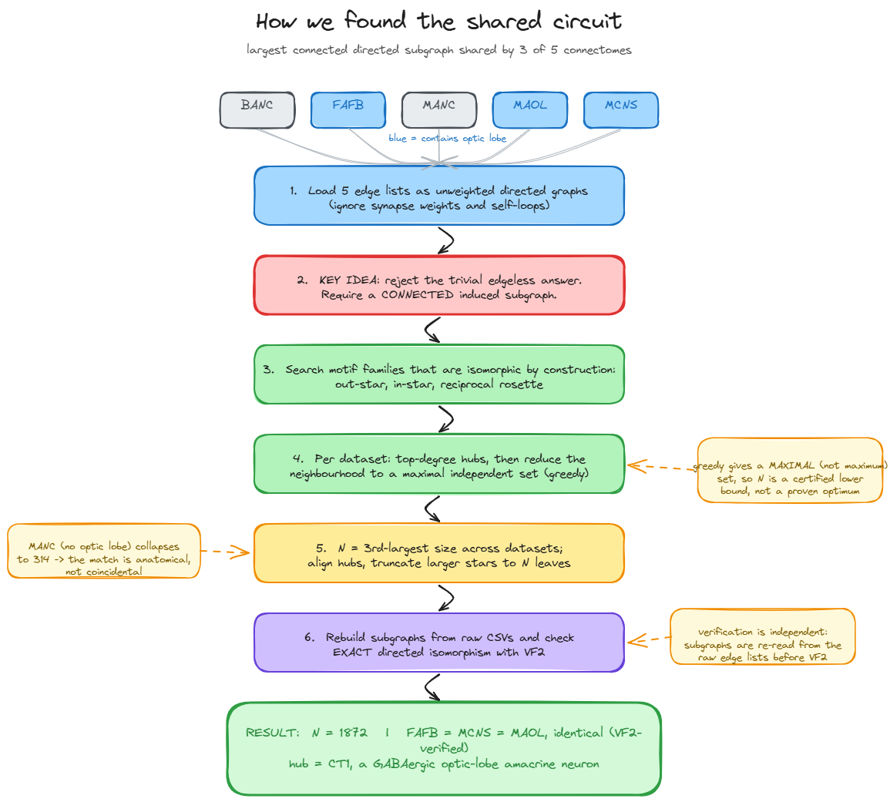
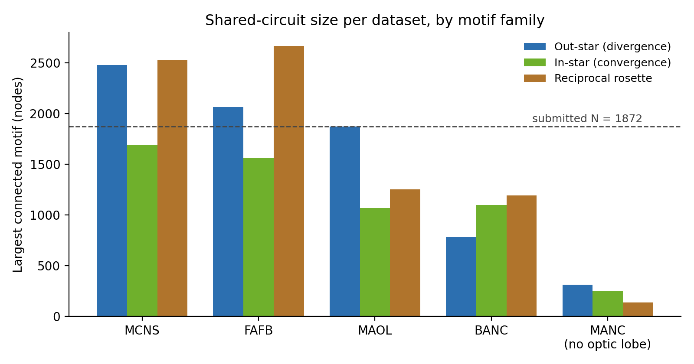

# FlyWire shared circuit

Largest **connected** directed induced subgraph shared across at least three of the five FlyWire Codex connectomes (BANC, FAFB, MANC, MAOL, MCNS).

**Result:** a divergence motif of **N = 1872** neurons (one hub driving 1871 mutually non-adjacent targets), with directed structure **identical across FAFB, MCNS, and MAOL**. The match is verified exactly by the VF2 algorithm. In FAFB the hub is the GABAergic optic-lobe amacrine neuron **CT1**.

## The shared circuit

In FAFB the hub is identified in Codex as **CT1** (root id `720575940628908548`), a single giant wide-field amacrine neuron that tiles the optic lobe. Full biological discussion is in [`science.md`](science.md).

| CT1 3D morphology | CT1 connectivity (Codex) |
| --- | --- |
|  |  |

Left: Codex 3D mesh of CT1 filling the left optic lobe. Right: its connectivity, GABAergic (gold), with heavy lobula input (LO_L) and output to medulla (ME_L) and lobula plate (LOP_L).

## Repository contents

| File | Description |
| --- | --- |
| `network.csv` | The solution: 3 columns (MCNS, FAFB, MAOL), 1872 rows, hub aligned in row 1 |
| `science.md` | One-page scientific summary (biology of the shared circuit) |
| `README.md` | This file: technical approach and reproduction |
| `process_flow.excalidraw` | Editable diagram of the method (open at excalidraw.com) |
| `figures/` | Network graph, CT1 mesh, CT1 connectivity, per-dataset motif sizes |
| `src/` | All analysis scripts and the saved intermediate result |

## Method



### The key assumption: reject the degenerate solution

Taken literally, "maximise N such that the induced subgraphs are isomorphic" has a trivial answer. Any set of mutually unconnected neurons induces an **edgeless** subgraph, and all edgeless graphs on N nodes are isomorphic. Connectomes are sparse, so such independent sets contain tens of thousands of neurons: a maximal but biologically empty "circuit." We reject this and require the shared subgraph to be **connected**, which is the only definition under which "circuit" is meaningful. We then seek the largest such N.

### Graph-matching strategy

Maximum common induced subgraph is NP-hard, so we do not claim a global optimum. We report a **certified lower bound** that is then verified exactly. We target three connected motif families whose *k*-node instances are isomorphic **by construction**, which reduces cross-dataset matching to size alignment:

- **out-star** (divergence): one hub, edges hub to *k* leaves, leaves pairwise non-adjacent
- **in-star** (convergence): *k* pairwise non-adjacent sources, edges to one hub
- **reciprocal rosette**: one hub with reciprocal edges to *k* pairwise non-adjacent leaves

These families are chosen deliberately. Among connected subgraphs that scale to hundreds of nodes across three independent nervous systems, a star needs only one high-degree hub plus a pairwise non-adjacent neighbourhood, whereas denser motifs impose quadratically many edge constraints that do not co-occur at this size.

### Heuristic per dataset

For each candidate hub (top 250 by relevant degree), the leaf set is the hub's directional neighbourhood reduced to a **maximal independent set** by a greedy ascending-degree rule. This guarantees the induced subgraph is exactly the target motif. Because the set is maximal rather than maximum (maximum independent set is itself NP-hard), each per-dataset size is a lower bound. The best hub per dataset is kept.

### Combining datasets and verifying

N is the third-largest per-dataset motif size, so the circuit is present in at least three datasets. Larger instances are truncated to N leaves; a sub-star of a star is still a star, so the induced structure is preserved. Each reported solution is then **re-extracted independently from the raw edge lists** (not trusted from the search-time adjacency) and checked with the **VF2 algorithm** (`networkx.algorithms.isomorphism.DiGraphMatcher`) for exact directed isomorphism. This confirms both the clean star structure (1871 edges, all from the hub) and the pairwise cross-dataset match.

### Results by motif



| Motif (connected) | Datasets | N |
| --- | --- | --- |
| Out-star (divergence) | FAFB, MCNS, MAOL | **1872** |
| Reciprocal rosette | FAFB, MCNS, MAOL | 1250 |
| In-star (convergence) | FAFB, MCNS, BANC | 1097 |

The out-star is submitted because it gives the largest verified N. The motif is large only in the optic-lobe datasets and collapses in the optic-lobe-free ventral nerve cord (MANC, max 314), which is evidence the correspondence is anatomical rather than coincidental. See `science.md` for the biology.

## Assumptions

- Edge weights (synapse counts) are ignored, as instructed; graphs are treated as unweighted and directed.
- Self-loops are removed; a duplicated edge is treated as a single directed edge.
- A "circuit" must be connected (see above). The reported N is a certified lower bound on the maximum connected common induced subgraph, not a proven optimum.
- Neuron identifiers are not shared across datasets, so matching is structural. Because every k-node star is isomorphic to every other, the cross-dataset correspondence is any size-preserving bijection that maps hub to hub; biological homology is a separate claim, confirmed in Codex for the FAFB hub only.

## Reproduce

Requires Python 3.11 with `pandas`, `numpy`, `networkx`, `matplotlib`. Place the five Codex edge-list CSVs in the working directory with these names: `banc_626_edge_list.csv`, `fafb_783_edge_list.csv`, `manc_1.2.1_edge_list.csv`, `maol_1.1_edge_list.csv`, `mcns_0.9_edge_list.csv`.

```bash
pip install pandas numpy networkx matplotlib

# 1. Search each dataset for the largest motif of each family -> src/star_results.json
python src/analyze.py

# 2. Re-extract the chosen subgraphs from raw edge lists, run VF2, write network.csv
python src/verify_and_emit.py

# 3. Figures
python src/viz.py                 # network graph of the circuit
python src/motif_sizes_plot.py    # per-dataset motif sizes (run from src/)
```

`src/star_results.json` is included so steps 2 and 3 can be run without repeating the full search. Expected output of step 2:

```
[MCNS] nodes=1872 edges=1871 edges_from_hub=1871 -> OK exact star
[FAFB] nodes=1872 edges=1871 edges_from_hub=1871 -> OK exact star
[MAOL] nodes=1872 edges=1871 edges_from_hub=1871 -> OK exact star
VF2 isomorphic  MCNS <-> FAFB: True
VF2 isomorphic  MCNS <-> MAOL: True
```

## network.csv format

Three columns headed by the dataset names (`MCNS,FAFB,MAOL`) and 1872 rows. Row 1 is the three hub neurons (the aligned center of the star); rows 2 to 1872 are the matched targets. Any row *i* gives one neuron from each dataset that occupy the same position in the isomorphic structure.
