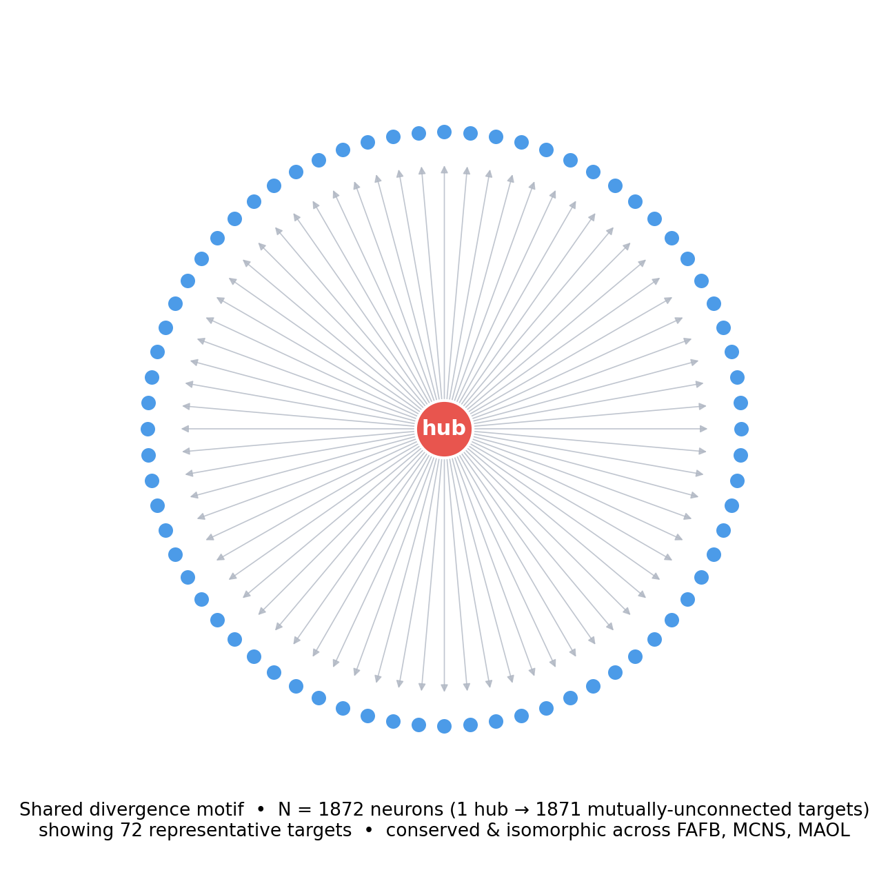
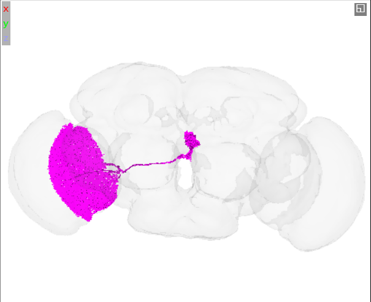
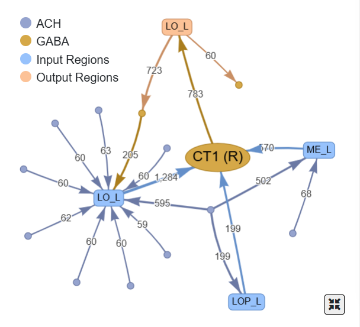

# CT1: a conserved GABAergic amacrine divergence hub across three *Drosophila* optic lobes

**Shared circuit:** one hub driving N = 1871 mutually non-adjacent targets (N = 1872 nodes, 1871 directed edges), directed structure identical across **FAFB**, **MCNS**, **MAOL** (VF2-verified). Biology focus: **FAFB v783**.

*Approach in one line:* the literal objective is maximised by edgeless (independent) vertex sets, which are mutually isomorphic but biologically empty, so we instead required the shared subgraph to be **connected** and report an exactly verified result.

## The circuit

The submitted circuit is a directed **out-star** (divergence): one presynaptic hub to many targets that have no edges among themselves, so the induced subgraph is exactly 1871 edges, all leaving the hub. In FAFB, Codex identifies the hub (`720575940628908548`, label LO.5422) as **CT1**: super-class *optic*, sub-class *lobula-medulla amacrine*, predicted **GABA** (confidence 0.64), with 5,997 upstream and 6,447 downstream partners. It is the single highest out-divergence neuron recovered in each optic-lobe dataset. CT1 is a giant wide-field amacrine neuron that tiles the optic lobe, sending one arbor into each retinotopic column of the medulla and lobula.

*Fig. 1. The circuit in FAFB (72 of 1871 targets shown). Red: hub CT1; blue: the non-adjacent target subset defining the induced star.*

## Observations

- **Large only where CT1 exists.** The out-star reaches 1872 in the optic-lobe datasets (FAFB, MCNS, MAOL) but collapses to 314 in MANC (ventral nerve cord, no optic lobe), as expected if the match is anatomical rather than coincidental. Codex lists CT1 instances in BANC (2), FAFB (2), MAOL (1), MCNS (2).
- **The non-adjacent target set exists rather than being forced.** That hundreds of CT1's targets *can* be chosen pairwise non-adjacent implies they carry little lateral connectivity, consistent with a column-by-column output. CT1 is independently known to split into hundreds of electrically isolated compartments, roughly one per column (Meier & Borst 2019), a mechanism for such parallel channels.
- **The hub is also recurrently wired.** Searching a reciprocal-rosette variant (hub with bidirectional edges to pairwise non-adjacent partners) returns a circuit of 1250 nodes shared by the same three datasets, indicating CT1 not only broadcasts but also receives reciprocal input from a large columnar population, the substrate for local feedback.

 
*Fig. 2-3. Left: Codex 3D mesh of CT1 filling the left optic lobe. Right: connectivity, GABAergic (gold), heavy lobula input (LO_L, 1,284 synapses) with output to medulla (ME_L) and lobula plate (LOP_L).*

## Hypothesis

An **inhibitory divergence / gain-control** motif: CT1 distributes a GABAergic signal in parallel across many columns. CT1 is part of the T4/T5 motion-detection circuitry (Takemura 2017; Shinomiya 2019), where wide-field inhibition is a candidate substrate for spatial normalisation; fan-out to a weakly coupled target set fits parallel labelled-line processing, in which a common signal reaches many channels without lateral crosstalk. The combination of broad divergence with reciprocal feedback (above) is consistent with a normalisation pool that scales its own gain.

**Testable prediction.** If the motif is functional rather than incidental, the candidate homologues identified by topology in MCNS and MAOL (`10157`, `10046`) should also be GABAergic optic-lobe amacrine neurons with a comparable columnar fan-out, and perturbing CT1 should degrade direction selectivity in T4/T5 outputs.

**Limits.** The isomorphism is exact and machine-verified but *topological*; it does not by itself establish homology. The hub is confirmed as CT1 only in FAFB. The MCNS and MAOL hubs are strong candidate homologues to confirm in Codex.

## References

1. Meier M, Borst A (2019) Extreme compartmentalization in a *Drosophila* amacrine cell. *Current Biology* 29:1545–1550.
2. Shinomiya K, et al. (2019) Comparative connectomics of the two motion pathways in *Drosophila*. *eLife* 8:e40025.
3. Takemura S, et al. (2017) Comprehensive connectome of a motion-detection substrate. *eLife* 6:e24394.
4. Dorkenwald S, et al. (2024) Neuronal wiring diagram of an adult brain. *Nature* 634:124–138.
5. Schlegel P, et al. (2024) Whole-brain annotation and multi-connectome cell typing of *Drosophila*. *Nature* 634:139–152.
6. Matsliah A, et al. (2024) Neuronal parts list and wiring diagram for a visual system. *Nature* 634:153–165.
7. Milo R, et al. (2002) Network motifs. *Science* 298:824–827.
